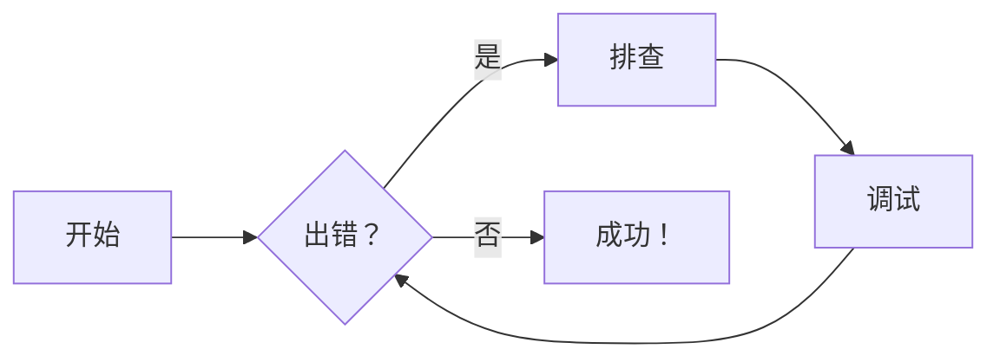
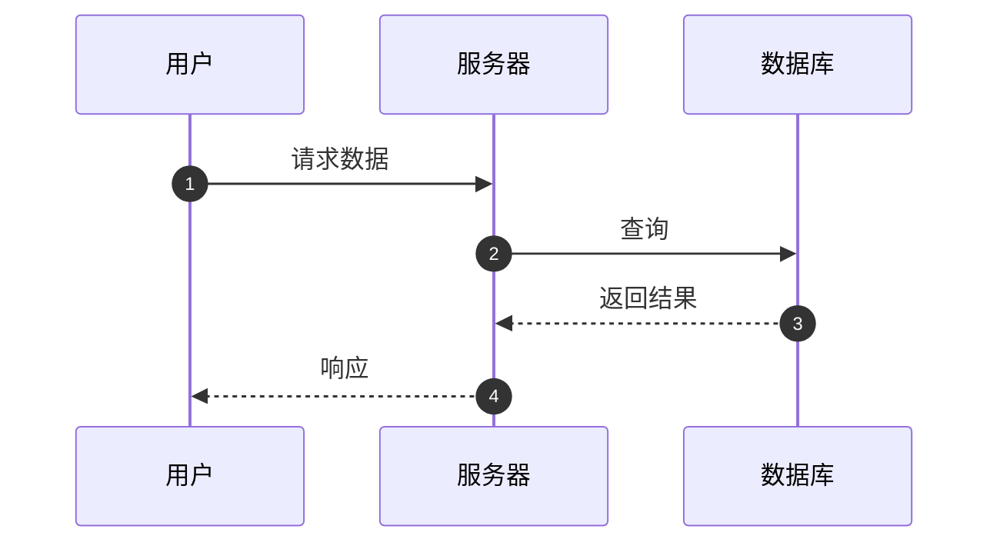
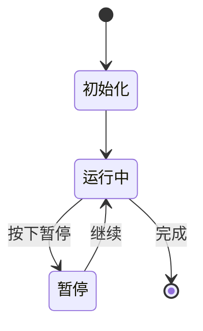
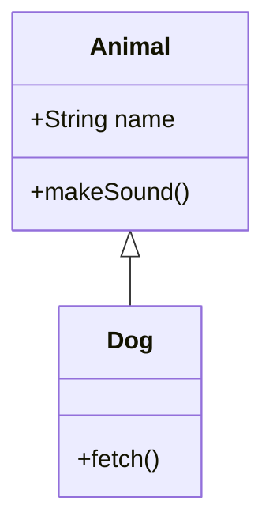
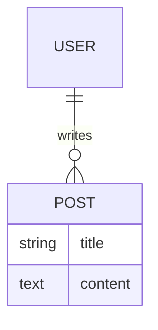

# Zensical


## 1. 提示块

### 1. 基础语法

!!! note

    这是一个普通提示块。

对应的 markdown 代码：
~~~markdown
!!! note

    这是一个普通提示块。
~~~

---

### 2. 自定义标题

!!! tip "高效技巧"

    使用 `Ctrl+Shift+P` 打开命令面板。

对应的 markdown 代码：
~~~markdown
!!! tip "高效技巧"

    使用 `Ctrl+Shift+P` 打开命令面板。
~~~

---

### 3. 隐藏标题

!!! danger ""

    操作不可逆！

对应的 markdown 代码：
~~~markdown
!!! danger ""

    操作不可逆！
~~~

---

### 4. 可折叠块

??? question

    点击展开常见问题。

对应的 markdown 代码：
~~~markdown
??? question

    点击展开常见问题。
~~~

#### 默认展开

???+ success "已完成"

    构建成功，无错误。

对应的 markdown 代码：
~~~markdown
???+ success "已完成"

    构建成功，无错误。
~~~

---

### 5. 内联提示（侧边浮动）

!!! info inline end "说明"

    此为右浮动提示块。

对应的 markdown 代码：
~~~markdown
!!! info inline end "说明"

    此为右浮动提示块。
~~~

> ⚠️ 必须写在目标段落**之前**，窄屏自动转为块级。

---

### 6. 嵌套提示块

!!! note "外层"

    外层内容。

    !!! warning "内层"

        内层警告。

对应的 markdown 代码：
~~~markdown
!!! note "外层"

    外层内容。

    !!! warning "内层"

        内层警告。
~~~

---

### 7. 支持的类型

!!! note
    这是一条普通提示。

~~~markdown
!!! note
    这是一条普通提示。
~~~

---

!!! abstract
    这是摘要内容。

~~~markdown
!!! abstract
    这是摘要内容。
~~~

---

!!! info
    这是一条信息说明。

~~~markdown
!!! info
    这是一条信息说明。
~~~

---

!!! tip
    这是一个实用小技巧。

~~~markdown
!!! tip
    这是一个实用小技巧。
~~~

---

!!! success
    操作已成功完成！

~~~markdown
!!! success
    操作已成功完成！
~~~

---

!!! question
    这是一个常见问题。

~~~markdown
!!! question
    这是一个常见问题。
~~~

---

!!! warning
    请注意潜在风险！

~~~markdown
!!! warning
    请注意潜在风险！
~~~

---

!!! failure
    操作失败，请重试。

~~~markdown
!!! failure
    操作失败，请重试。
~~~

---

!!! danger
    高危操作，谨慎执行！

~~~markdown
!!! danger
    高危操作，谨慎执行！
~~~

---

!!! bug
    此处存在已知缺陷。

~~~markdown
!!! bug
    此处存在已知缺陷。
~~~

---

!!! example
    这是一个使用示例。

~~~markdown
!!! example
    这是一个使用示例。
~~~

---

!!! quote
    这是一段引用文字。

~~~markdown
!!! quote
    这是一段引用文字。
~~~

---

## 2. 按钮

### 1. 基础按钮

[前往 oiwiki 学习](https://oi-wiki.org/){ .md-button }

~~~markdown
[前往 oiwiki 学习](https://oi-wiki.org/){ .md-button }
~~~

---

### 2. 主要按钮（Primary）

[前往 oiwiki 学习](https://oi-wiki.org/){ .md-button .md-button--primary }

~~~markdown
[前往 oiwiki 学习](https://oi-wiki.org/){ .md-button .md-button--primary }
~~~

---

### 3. 带图标按钮

[前往 oiwiki 学习 :fontawesome-solid-graduation-cap:](https://oi-wiki.org/){ .md-button }

~~~markdown
[前往 oiwiki 学习 :fontawesome-solid-graduation-cap:](https://oi-wiki.org/){ .md-button }
~~~

---

### 4. 主要按钮 + 图标

[前往 oiwiki 学习 :fontawesome-solid-book-open:](https://oi-wiki.org/){ .md-button .md-button--primary }

~~~markdown
[前往 oiwiki 学习 :fontawesome-solid-book-open:](https://oi-wiki.org/){ .md-button .md-button--primary }
~~~

---

### 5. 多个按钮并排（行内）

[取消](https://oi-wiki.org/){ .md-button }
[前往 oiwiki 学习 :fontawesome-solid-check:](https://oi-wiki.org/){ .md-button .md-button--primary }

~~~markdown
[取消](https://oi-wiki.org/){ .md-button }
[前往 oiwiki 学习 :fontawesome-solid-check:](https://oi-wiki.org/){ .md-button .md-button--primary }
~~~

> 💡 提示：多个按钮可通过换行或空格自然排列，适合表单操作区。

---

## 3. 代码块

### 1. 基础语法高亮

```python
import tensorflow as tf
```

~~~markdown
```python
import tensorflow as tf
```
~~~

---

### 2. 添加标题

```python title="bubble_sort.py"
def bubble_sort(items):
    for i in range(len(items)):
        for j in range(len(items) - 1 - i):
            if items[j] > items[j + 1]:
                items[j], items[j + 1] = items[j + 1], items[j]
```

~~~markdown
```python title="bubble_sort.py"
def bubble_sort(items):
    for i in range(len(items)):
        for j in range(len(items) - 1 - i):
            if items[j] > items[j + 1]:
                items[j], items[j + 1] = items[j + 1], items[j]
```
~~~

---

### 3. 行号显示

```python linenums="1"
def bubble_sort(items):
    for i in range(len(items)):
        for j in range(len(items) - 1 - i):
            if items[j] > items[j + 1]:
                items[j], items[j + 1] = items[j + 1], items[j]
```

~~~markdown
```python linenums="1"
def bubble_sort(items):
    for i in range(len(items)):
        for j in range(len(items) - 1 - i):
            if items[j] > items[j + 1]:
                items[j], items[j + 1] = items[j + 1], items[j]
```
~~~

---

### 4. 高亮特定行

```python hl_lines="2 3"
def bubble_sort(items):
    for i in range(len(items)):
        for j in range(len(items) - 1 - i):
            if items[j] > items[j + 1]:
                items[j], items[j + 1] = items[j + 1], items[j]
```

~~~markdown
```python hl_lines="2 3"
def bubble_sort(items):
    for i in range(len(items)):
        for j in range(len(items) - 1 - i):
            if items[j] > items[j + 1]:
                items[j], items[j + 1] = items[j + 1], items[j]
```
~~~

---

### 5. 代码注解（Annotations）

```toml
[project.theme]
features = ["content.code.annotate"] # (1)!
```

1. :man_raising_hand: 这是一个代码注解！支持 **加粗**、`代码`、列表等 Markdown 内容。

~~~markdown
```toml
[project.theme]
features = ["content.code.annotate"] # (1)!
```

1. :man_raising_hand: 这是一个代码注解！支持 **加粗**、`代码`、列表等 Markdown 内容。
~~~

---

### 6. 注解（去除注释符号）

```yaml
# (1)!
```

1. 看，没有注释符号了！

~~~markdown
```yaml
# (1)!
```

1. 看，没有注释符号了！
~~~

> ⚠️ 每行仅支持一个注解，且需以 `# (n)!` 格式结尾。

---

### 7. 行内代码高亮

The `#!python range()` function generates number sequences.

~~~markdown
The `#!python range()` function generates number sequences.
~~~

---

## 4. 内容标签页

### 1. 基础用法（代码分组）

=== "Python"
    ```python
    print("Hello, Zensical!")
    ```

=== "JavaScript"
    ```javascript
    console.log("Hello, Zensical!");
    ```

~~~markdown
=== "Python"
    ```python
    print("Hello, Zensical!")
    ```

=== "JavaScript"
    ```javascript
    console.log("Hello, Zensical!");
    ```
~~~

---

### 2. 普通内容分组

=== "特点"
    - 轻量级
    - 响应式
    - 支持嵌套

=== "适用场景"
    1. 多语言 API 示例
    2. 不同配置对比
    3. 环境差异说明

~~~markdown
=== "特点"
    - 轻量级
    - 响应式
    - 支持嵌套

=== "适用场景"
    1. 多语言 API 示例
    2. 不同配置对比
    3. 环境差异说明
~~~

---

### 3. 嵌套在提示块中

!!! example
    === "YAML"
        ```yaml
        site_name: My Docs
        theme: zensical
        ```

    === "TOML"
        ```toml
        [site]
        name = "My Docs"
        theme = "zensical"
        ```

~~~markdown
!!! example
    === "YAML"
        ```yaml
        site_name: My Docs
        theme: zensical
        ```

    === "TOML"
        ```toml
        [site]
        name = "My Docs"
        theme = "zensical"
        ```
~~~

---

### 4. 多层嵌套标签页

=== "前端"
    === "React"
        ```jsx
        <h1>Hello</h1>
        ```

    === "Vue"
        ```vue
        <template><h1>Hello</h1></template>
        ```

=== "后端"
    === "Node.js"
        ```js
        res.send('Hello');
        ```

    === "Python"
        ```python
        return "Hello"
        ```

~~~markdown
=== "前端"
    === "React"
        ```jsx
        <h1>Hello</h1>
        ```

    === "Vue"
        ```vue
        <template><h1>Hello</h1></template>
        ```

=== "后端"
    === "Node.js"
        ```js
        res.send('Hello');
        ```

    === "Python"
        ```python
        return "Hello"
        ```
~~~

---

## 5. 数据表格

### 1. 基础表格

| 方法     | 描述                     |
| -------- | ------------------------ |
| `GET`    | :lucide-check: 获取资源   |
| `PUT`    | :lucide-check-check: 更新资源 |
| `DELETE` | :lucide-x: 删除资源       |

~~~markdown
| 方法     | 描述                     |
| -------- | ------------------------ |
| `GET`    | :lucide-check: 获取资源   |
| `PUT`    | :lucide-check-check: 更新资源 |
| `DELETE` | :lucide-x: 删除资源       |
~~~

---

### 2. 列对齐（左 / 居中 / 右）

| 左对齐       | 居中对齐      | 右对齐        |
| :----------- | :-----------: | ------------: |
| 内容 A       | 内容 B        | 内容 C        |
| `code`       | **加粗**      | ==高亮==      |

~~~markdown
| 左对齐       | 居中对齐      | 右对齐        |
| :----------- | :-----------: | ------------: |
| 内容 A       | 内容 B        | 内容 C        |
| `code`       | **加粗**      | ==高亮==      |
~~~

---

## 6. 图表

### 1. 流程图（Flowchart）



~~~markdown

~~~

---

### 2. 序列图（Sequence Diagram）



~~~markdown

~~~

---

### 3. 状态图（State Diagram）



~~~markdown

~~~

---

### 4. 类图（Class Diagram）



~~~markdown

~~~

---

### 5. ER 图（实体关系图）



~~~markdown

~~~

---

## 7. 脚注

### 1. 行内脚注引用

Lorem ipsum[^1] dolor sit amet.[^2]

~~~markdown
Lorem ipsum[^1] dolor sit amet.[^2]
~~~

---

### 2. 单行脚注内容

[^1]: 这是一个简短的脚注说明。

~~~markdown
[^1]: 这是一个简短的脚注说明。
~~~

---

### 3. 多行脚注内容

[^2]:
    这是一个较长的脚注，包含多行内容。
    可用于补充详细解释、参考资料或备注信息。

~~~markdown
[^2]:
    这是一个较长的脚注，包含多行内容。
    可用于补充详细解释、参考资料或备注信息。
~~~

---

## 8. 格式化

### 1. 高亮文本

==这是高亮内容==

~~~markdown
==这是高亮内容==
~~~

---

### 2. 下划线（插入标记）

^^这是下划线内容^^

~~~markdown
^^这是下划线内容^^
~~~

---

### 3. 删除线

~~这是删除线内容~~

~~~markdown
~~这是删除线内容~~
~~~

---

### 4. 下标

H~2~O

~~~markdown
H~2~O
~~~

---

### 5. 上标

A^T^A

~~~markdown
A^T^A
~~~

---

### 6. 键盘按键

++ctrl+alt+del++

~~~markdown
++ctrl+alt+del++
~~~

---

好的！严格遵循你笔记的极简风格：**仅展示渲染效果 + 对应代码块，无解释性文字，用 `---` 分隔**。以下是 **Grids（网格布局）** 章节的续写：

---

## 9. 网格布局

### 1. 卡片网格（列表语法）

<div class="grid cards" markdown>

- :fontawesome-brands-python: __Python__
  通用编程语言

- :fontawesome-brands-js: __JavaScript__
  前端核心语言

- :fontawesome-brands-github: __GitHub__
  代码托管平台

</div>

~~~markdown
<div class="grid cards" markdown>

- :fontawesome-brands-python: __Python__
  通用编程语言

- :fontawesome-brands-js: __JavaScript__
  前端核心语言

- :fontawesome-brands-github: __GitHub__
  代码托管平台

</div>
~~~

---

### 2. 卡片网格（块级语法）

<div class="grid" markdown>

:fontawesome-brands-html5: __HTML__ 结构
{ .card }

:fontawesome-brands-css3: __CSS__ 样式
{ .card }

> :material-lightbulb: 提示内容
{ .card }

</div>

~~~markdown
<div class="grid" markdown>

:fontawesome-brands-html5: __HTML__ 结构
{ .card }

:fontawesome-brands-css3: __CSS__ 样式
{ .card }

> :material-lightbulb: 提示内容
{ .card }

</div>
~~~

---

### 3. 通用网格（混合内容）

<div class="grid" markdown>

!!! note "提示"
    这是一个提示块。

```python
print("Hello Grid!")
```

| 工具 | 用途 |
|------|------|
| VS Code | 编辑器 |
| Git | 版本控制 |

</div>

~~~markdown
<div class="grid" markdown>

!!! note "提示"
    这是一个提示块。

```python
print("Hello Grid!")
```

| 工具 | 用途 |
|------|------|
| VS Code | 编辑器 |
| Git | 版本控制 |

</div>
~~~

---

## 10. 列表

### 1. 无序列表

- 一级项
  - 二级项
    - 三级项

~~~markdown
- 一级项
  - 二级项
    - 三级项
~~~

---

### 2. 有序列表

1. 第一步
2. 第二步
    1. 子步骤一
    2. 子步骤二

~~~markdown
1. 第一步
2. 第二步
    1. 子步骤一
    2. 子步骤二
~~~

---

### 3. 定义列表

`关键词 A`
: 定义内容 A。

`关键词 B`
: 定义内容 B，
    可跨多行。

~~~markdown
`关键词 A`
: 定义内容 A。

`关键词 B`
: 定义内容 B，
    可跨多行。
~~~

---

### 4. 任务列表

- [x] 已完成任务
- [ ] 未完成任务
    - [x] 子任务完成
    - [ ] 子任务待办

~~~markdown
- [x] 已完成任务
- [ ] 未完成任务
    - [x] 子任务完成
    - [ ] 子任务待办
~~~

---